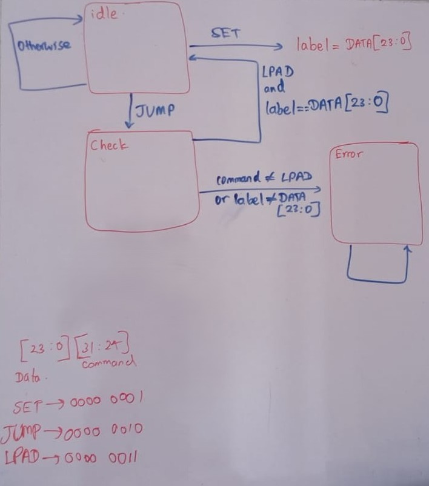

# RISC-V CFI Landing-Pad FSM

A 3-state SystemVerilog FSM modelling the
forward-edge control-flow-integrity check of the RISC-V Zicfilp
extension. Submission for the LFX mentorship coding challenge.

## Zicfilp correspondence

| This design            | Zicfilp                                    |
|------------------------|--------------------------------------------|
| SET stores label       | establishing expected label (x7 / t2)      |
| JUMP → CHECK           | indirect jump sets ELP = LP_EXPECTED       |
| LPAD + match → IDLE    | landing pad with matching label clears ELP |
| mismatch → ERROR       | software-check exception (landing pad fault)|

Simplifications: the real ELP is a two-value flag, and a real fault raises an exception rather than latching a trap state.

## Design decisions

- **Registered (Moore) error output.** `error_o` is a function of state
  alone, so it asserts one cycle after the violating packet. Tradeoff:
  one cycle of detection latency in exchange for a glitch-free output
  with no combinational path from the data inputs.

- **ERROR is exited only by external reset (`rstn_i`).** Deliberate:
  software running under the checker cannot clear its own violation
  flag; only the party controlling reset can. A trap, not a status bit.

- **Label storage lives in the clocked block.** `label` is state, so it
  is written in `always_ff` under an enable (IDLE + SET) rather than in
  combinational code, where conditional assignment would infer a latch.

## Known limitations and open questions

- An LPAD received in IDLE is silently ignored; depending on the threat model, an unexpected landing pad could itself be treated as a violation. The spec is silent, so I chose to ignore it.
- In the CHECK state the program expects the LPAD command on the very next cycle. If it doesn't receive it the state goes into ERROR state.

## Verification

- Self-checking testbench: golden reference model compared cycle-by-cycle via SVA, 8 directed test phases covering match/mismatch/stickiness/reset-label and command-ordering corners.
- Lint-clean under Verilator (-Wall).
- Simulated with VCS (via EDA Playground): https://www.edaplayground.com/x/j4Mm

## Running

    # Lint the design
    verilator --lint-only -Wall cfi.sv
